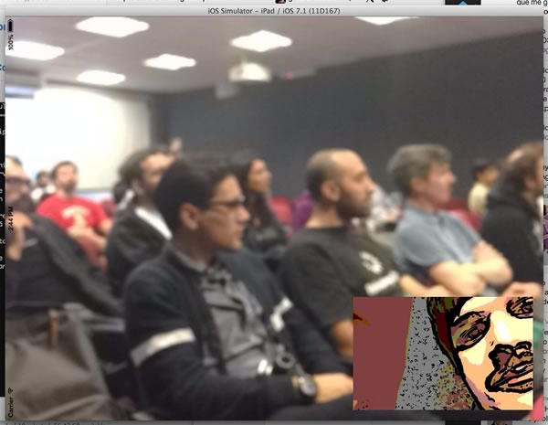
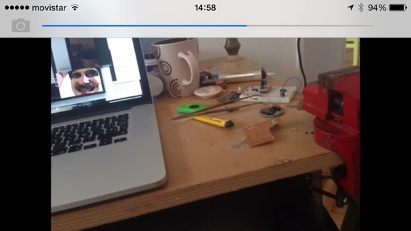

NSConf Argentina 2014 - Multipeer Connectivity Demo
===================================================

Demo de la charla de Multipeer Connectivity dada en el NSConf Argentina 2014 en la UP.

== Advertiser ==

Cuando la aplicación es iniciada desde un iPad, comienza en modo Advertiser, notificando a cualquier dispositivo que esté en modo Browser que el servicio está corriendo en este dispositivo.

El browser se encargará de pedir permiso al advertiser para iniciar una sesión de MultipeerConnectivity. El advertiser siempre aceptará la sesión y comenzará la espera de la transferencia de recursos.

Una vez transferidos los recursos `back.jpg` y `front.jpg`, se generará un bundle con estos dos archivos, junto con un `info.plist` que contendrá el nombre del peer que envió los recursos.

Luego, se mostrará en pantalla el set de imagenes recibidas.

La aplicación además puede detectar la conexión de una pantalla externa. Ante dicho evento, se mostrará en la misma la foto posterior, y en la pantalla del dispositivo la foto frontal.

== Discovery ==

Cuando la aplicación es iniciada desde un iPhone, comienza en modo Browser, buscando dispositivos que estén notificando un servicio en modo advertiser.

Cuando el usuario captura una foto, la misma (junto con una captura de la cámara frontal) es almacenada en un archivo temporal. Inmediatamente después, se inicia una sesión de MultipeerConnectivity, y se comienza a buscar un dispositivo que esté anunciando la presencia del servicio. Una vez detectado el mismo, se pide permiso para unirlo a la sesión, y se comienza con la trasnferencia de los recursos de la misma.

Un filtro es aplicado a la imagen frontal para distorcionar la cara.

Una vez terminado el envío, o bien en caso de llegar a un timeout, la aplicación retorna al estado de reposo donde el usuario podrá tomar otra foto.

